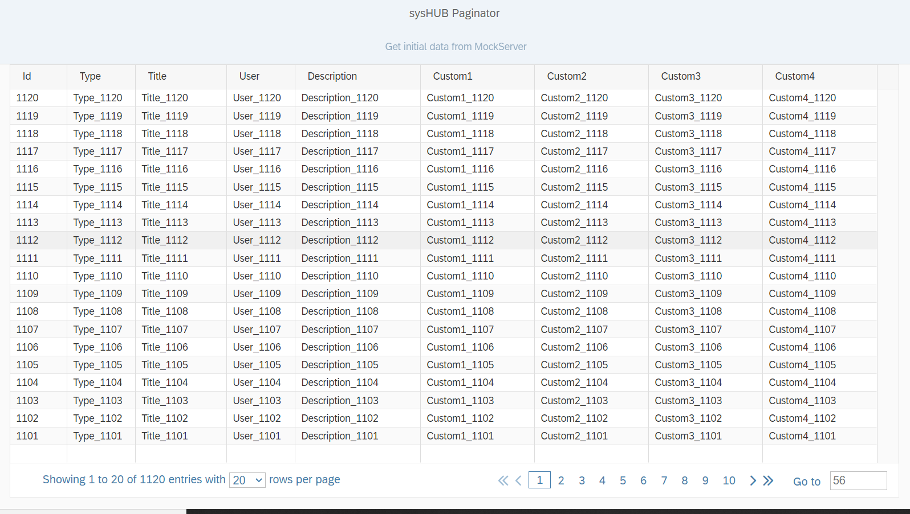

# openui5-paginator

openui5-paginator is a SAPUI5 Custom Control that allow you to handle large data in a Table. Navigation is done via paging.



## Motivation
We are using openUI5 on the client side as the base technologie for our product "sysHUB". On the server side we are using our own REST based API.
The main thing is, we are working with large table entries. The base technologie of openUI5 and sapUI5 is oData V4 to get data from the backend.
In our case this is not a good choice, because we are providing some REST-Services for our customer and we can not implement REST-Services 
and oData Services to the same time in our product. In an earlier version of openUI5 there was 
a paginator included, but it was removed since 1.45 (I think). We are going on to develop the paginator to work with all newer versions
and extended it with some useful features.


## Demo

If you check out this project, there is a "demo" app to see how the paginator works. We are using WebStorm as development IDE.
Configure it as a "JavaScript Debug" run configuration to debug the demo app.

You can also use this link to see a working example:  [openui5-paginator-demo](https://wolfe100.github.io/)

## Usage the control

### Configure manifest.json

Add the library to sap.ui5 dependencies list and configure the resourceRoots to point where you uploaded the custom library.
In this case it is the "thirdparty" folder in your project. This folder must be in the webapp root location.

```json
"sap.ui5": {
    ...
	"dependencies": {
		"minUI5Version": "1.102.2",
		"libs": {
    		...
			"syshub.controls": {}
		}
	},
	"resourceRoots": {
		"syshub.controls": "./thirdparty/syshub/controls/"
	}
}
```

### Add the custom control inside an XML View

First of all add the namespace to the View

```xml
xmlns:lab="syshub.controls"
xmlns:t="sap.ui.table"

```

And then you can simply add the Paginator custom control to your "sap.ui.table"

```xml
<t:Table ...>
    <t:footer>
        <lab:Paginator id="idPaginator"
                       currentPage="{modelEntriesMetadata>/currentPage}"
                       entriesAbsolute="{modelEntriesMetadata>/entriesAbsolute}"
                       entriesPerPage="{modelEntriesMetadata>/entriesPerPage}"
                       numberOfVisiblePages="10"
                       showGoto="true"
                       entriesPerPageVisible = "true"
                       showSpinner="{modelEntriesMetadata>/showSpinner}"
                       page="onPage"
                       entriesPerPageChanged = "onEntriesPerPageChanged">
        </lab:Paginator>
    <t:footer>
    <t:columns>
        ...
    </t:columns>
</t:Table>
```

## Parameters

| Name                 | Type   | Default | Description
|:---------------------|:-------|:--------| :---------  |
| currentPage          | number | 0       | The current selected page or the page to set
| entriesAbsolute      | number | 0       | The absolute count of the entires given by the query
| showGoto             | bool   | false   | Shows the direct GOTO input field
| entriesPerPage       | int    | 10      | How much entries should shown of each page
| numberOfVisiblePages | number | 10      | How much pages shown which are directly selectable
| showSpinner          | bool   | false   | Shows a spinner to give the user information to get data from the server

## Events

### entriesPerPageChanged
| Parameter | Type | Description
|:----------|:-----| :---------  |
| offset    | int  | The offset where to start the new query
| limit     | int  | The new limit how many entries must get

### page
| Parameter  | Type | Description
|:-----------|:-----| :---------  |
| srcPage    | int  | The page which is the current one before the page event is fired (and another page is displayed)
| targetPage | int  | The page that shall be displayed next after the page event is fired.
| offset     | int  | The offset where to start the new query
| limit      | int  | The limit how many entries must get
| type      | syshub.controls.PaginatorEvent  | Provides the values 'First', 'Last', 'Next', 'Previous', 'Goto'. The event parameter informs the application how the user navigated to the new page: Whether the 'Next' button was used, or another button, or whether the page was directly selected


## Methods

| Name                                     |  Description
|:-----------------------------------------| :------------------- |
| setCurrentPage(PageNumber)               | Sets the current page
| getCurrentPage                           | Gets the current selected page
| setEntriesAbsolute(AbsoluteQueryEntries) | Sets the absolute query entries to compute the pages
| getEntriesAbsolute(AbsoluteQueryEntries) | Gets the absolute entries of the current query
| setShowGoto(boolean value)               | If true, the show "GOTO" input field is shown.
| getShowGoto()                            | Return the status of the showGoto property
| setEntriesPerPage(Number)                | Set the count of the page entries are shown
| GetEntriesPerPage()                      | Returns the number of page entries shown
| SetNumberOfVisiblePages(Number)          | Set the count of visible pages are shown
| getNumberOfVisiblePages()                | Gets the number of vissible pages shown
| setShowSpinner(boolean value)            | If true a spinner is shown, to give the user a feedback
| getShowSpinner()                         | Gets the status of the spinner

## Build

If you would like to extend and customize the control, you can easily do that but re-building the code with just a simple ui5 cli commands:

```
npm install
ui5 build
ui5 startApp
```

## How to work with the control
It is important to have a REST-Service with the following parameters. 

    eg: /webapi/v3/data/list?offset=0&limit=20&orderBy=id.desc&search=id<1000

We use RSQL-Queries in the orderBy and search criteria.

The first query has no "id" search criteria. This means we got a snapshot view of the table
and we got in the response header the "abs_count" and the "highest_id". All queries while paging,
limited the query in the search criteria with the highest_id. The reason for this is, growing up the table
with new entries will destroy paging if we don't have the highest_id in the search criteria.

### Known issues
One problem which we don't found a solution is removing of entries while paging. This means, 
if another instance removes entries which are included in the query, the result is different, regarding
the abs_count and the computing of paging can run in some problems but we live with this limitation. 

Please have a look of the DataService.js and the mockserver.js to understand how paging is working.

## Important
If the value "entriesAbsolute" = 0, the paginator is not shown. Be sure to set this value after a query.

## Credits

Wolfgang Haag

 - Email: [whaag@nt-ware.com](whaag@nt-ware.com)

## License
This project is licensed under the Apache 2.0 License - see the [LICENSE](LICENSE) file for details
